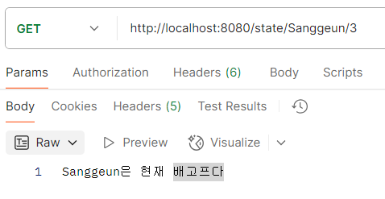

## 첫 과제 가봅시다

먼저 그냥 컨트롤러를 통해서 html 파일로 이동시켜 띄우는 과정!

그 말은 즉슨 제일 화려하게 할 수 있는 단계라는 거시다.

```
@Controller
public class BasicController {
    @RequestMapping("/home")
    public String home() {
        return "home.html";
    }
}
```

이 컨트롤러를 통해 ```./resource/static``` 디렉토리의 ```home.html```로 연결하여 준다.

이 html에는 어떤 파일이 있을까?


짜잔!

나(ChatGPT)는 프론트도 잘하기 때문에 무려 야식 랜덤 추천기를 만들어서 밤에 작업하느라 배고픈 나를 더 배고프게 만들었다.

솔직히 내(ChatGPT)가 잘 만들었으니 한 번씩 내 컨트롤러에 들어와서 돌려보기를 바란다.

다음은 RestController 연습 단계이다.

여기는 그냥 글만 나와서 급 흥미가 떨어져 인증만 하겠다.

```
@RequestMapping("/hungry")
    public String hungry() {
    return "새벽에 하니깐 겁나 배고프네";
}
```


```
@RequestMapping("/state/{name}/{state}")
    public String state(@PathVariable String name, @PathVariable int state) {
        if(state == 1) {
            return name + "은 현재 " + "기쁘다";
        } else if(state == 2) {
            return name + "은 현재 " + "슬프다";
        } else {
            return name + "은 현재 " + "배고프다";
        }
    }
```



else가 아니라 ```else if(state == 3)``` 을 받아야 하는 거 아닌가 생각할 수 있지만 오산이다.

나는 기쁘거나 슬프지 않으면 보통 배고프다. 밥 사주세요.

이렇게 URL 자체에 변수를 넣는 경우에는 변수가 충족되지 않으면 에러가 난다.

```
@RequestMapping("/delivery")
    public String delivery(@RequestParam (required = true, defaultValue = "메뉴를 입력하세요") String menu, @RequestParam(required = false, defaultValue = "-1") Integer count) {
        return "메뉴 : " + menu + "/ 시킨 개수 : " + count;
    }
```


치킨 열마리 먹고 싶다. 먹을 수 있다고는 안했다.

```@RequestParam```을 사용하면