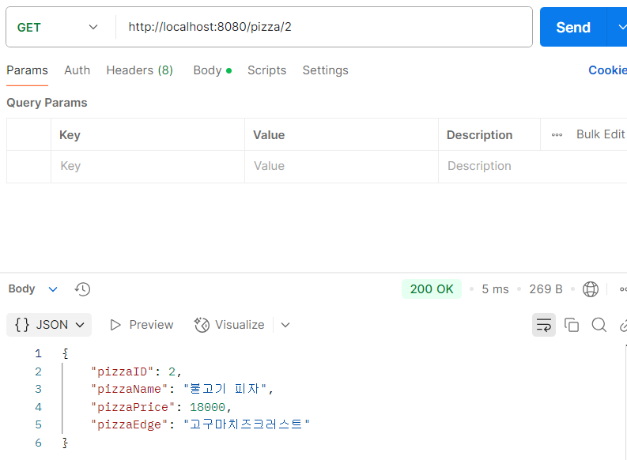
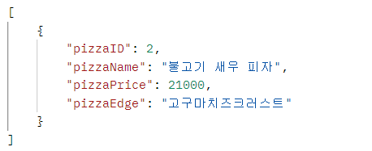

# HW2

---
# 🍕제일 중요한거🍕

컨셉을 뭘로 잡을까...

**"피자"**

- ID
- 이름
- 가격
- 엣지

---

### 나중에 한번에 정리하면 받아적기 밖에 안될 것 같아서 코딩하면서 시작하는 마크다운 작성기, 그냥 눈에 보이는대로 정리한 다음에 나중에 다시 공부하지 뭐 인정? 이것도 나름대로 나쁘지 않은 것 같습니다.

### 민규띠의 추천 순서: ENTITY ➡ CONTROLLER ➡ DTO ➡ SERVICE ➡ REPOSITORY


---

### Entity

> ⚛️ 챗직이의 한마디 : 데이터베이스 테이블과 일대일로 매핑되는 객체 즉, 데이터베이스의 Row에 해당

```
@Getter
@Setter
@NoArgsConstructor
@AllArgsContructor
@Builder
```
엔티티에서 필요한 어노테이션들이다.

```
public class Pizza {
    private int PizzaID;
    private String PizzaName;
    private int PizzaPrice;
    private String PizzaEdge;
}
```
피자에서 가장 중요한 부분은 토핑과 엣지... 토핑은 이름으로 퉁치자, ID는 왜 넣었느냐! 필요할 것 같아서 넣었다.

---

### Controller

> ⚛️ 챗직이의 한마디 : HTTP 요청을 처리하고 응답을 반환하는 웹 계층의 구성 요소. 클라이언트 요청을 적절한 서비스 로직 호출로 응답 처리
```
@RestController
@RequiredArgsConstructor
@RequestMapping("/pizza")
```
컨트롤러에 필요한 어노테이션들.

뭐 컨트롤러는 이전에 했던 그대로다.
URL을 통해서 연결할 수 있도록 한다. 그런데 이전에는 URL로만 다뤘어서 뭔가 겉핥기만 했던 것에 비해 이번에는 CRUD에 맞는 매핑을 하면서 좀 더 뭔가 알게 된 것 같은 느낌이다. 아닐 수도 있다.

---
### DTO

> ⚛️ 챗직이의 한마디 : 계층 간 데이터 전송을 위해 사용되는 객체로 Entity에서 필요한 필드만 선택적으로 포함. !네트워크 성능 최적화!

이 과제에서는 Entity와 구조가 같다. 하지만 현실에서는 이는 장바구니.. 필요한 것만 담아야 하는데 피자에서 필요없는 것 따윈 없어서 일단 다 담았다.

DTO는 더 큰 프로젝트에서 다뤄야 그 진가를 제대로 발휘할 것 같다. DTO는 장바구니에 담은 정보들을 모두 준다고 한다. 내 쿠팡 장바구니에 담긴 물건들도 누가 나한테 다 사주면 좋겠다.

---
### Service

> ⚛️ 챗직이의 한마디 : 비즈니스 로직을 처리하는 계층, Controller에서 호출되어 특정 작업 수행
```
@Service
@RequiredArgsConstructor
```
어노테이션 히히

Service는 로직을 처리하는 장소라고 한다. 하지만 우리는 애송이라 아직 DB를 다루지 않는다. 고로 나의 Service는 그저 Repo에게 '응애.' 할 뿐이다. 나의 모습과 비슷한 것 같다.

🗣️ **"사장님, 부사장님 해줘~"** > 둘이 합치면 나 민규임... 좋은데?

여튼 서비스는 DB를 다룰 때 본격적으로 해보자

---
### Repository

> ⚛️ 챗직이의 한마디 : DB와의 상호작용 담당. Entity 객체에 대한 CRUD 작업을 수행 (JPA, Spring Data를 사용)
```
@Repository
```
전용 어노테이션... 머시ㄸr

우리 금고 관리자님 Repository, 여기서는 그저 Service의 응애 받이일 뿐이다. 즉, 로직 구현이 여기에서 다 되어있다.

이도 DB를 다룰 때 제대로 ㅇrㄹr보ㅈr

---

# 결과보지말고앉아
#### (결과보고서의 드립 버전입니다 ㅎㅎ~)

---

## C (CREATE)


POST를 통해서 쌉근본 페퍼로니 피자를 만들었다.

## R (READ)


불고기 피자까지 만들고 GET을 통해 모두 조회를 해봤다. 가격이 이 정도만 돼도 많이 사먹을 것 같은데 피자 먹고 싶다.



URL에 ID값을 입력해서 컨트롤하면 해당 ID의 피자만 볼 수 있다. 불고기 피자에 고치크 조합이면 한판을 다 먹을 수 있을까?

## U (UPDATE)


이 불고기 피자를 더 맛있게 먹는 방법이 뭔지 아나? 바로 새우를 추가해주는 것이다. 와 근데 리얼 맛있을 것 같다.


하지만 어림도 없지! UPDATE이기 때문에 필요한 내용만 바꾸면 될 줄 알고 개멋있게 이름과 가격만 바꾸었다. 하지만 우리는 DB도 다룰 줄 모르는 응애이기에 생각대로 절대 되지 않는다.


깝치지 말고 정성스래 모든 데이터를 다 입력해준 후 검색한다. 나중에 서버랑 피자 먹으러 가자고 해야겠다.

## D (DELETE)


가장 마음이 아팠던 피자 없애기... 결과값만 보고 빠르게 X를 눌러 JOY를 표하자



값을 쪼잔하게 두 개밖에 안넣어 이렇게 보이지만 나름 Find All 한거다.

---

### 그럼 20,000

