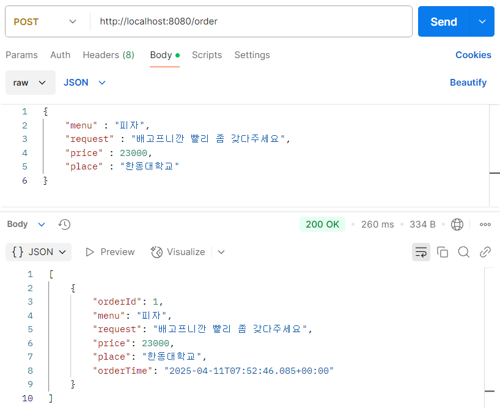
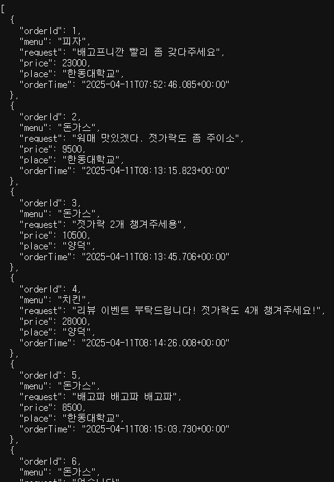
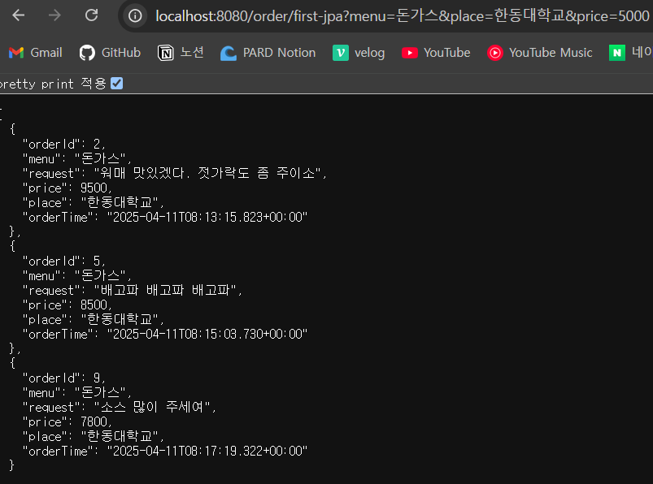
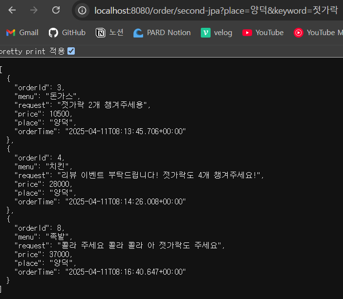
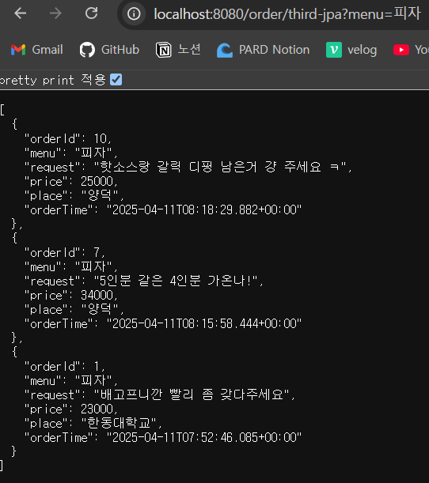
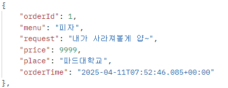
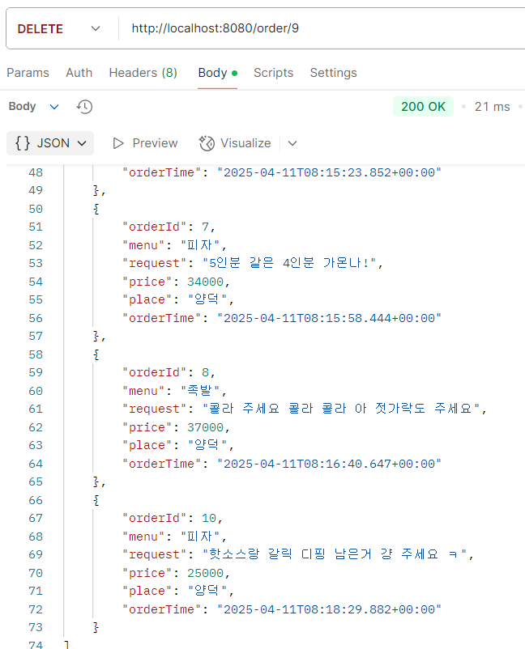

# HW3

## 실제 DB와 연결해버린 사건

---

### 🚵🏻‍♀️ 이번엔 배민으로 가봅시다잉
>- ID
>- menu
>- request
>- price
>- place
>- orderedAt

---

### DB 생성

각자 사용하는 DB 에디터(우리는 MySQL)에서 새로운 DB를 추가하고, 새로운 Connection 이름을 입력하고 우리의 MySQL 비밀번호를 입력하여 Test Connection을 하고 Successfully 하다면 생성!


*※ 너무 당연하지만 비밀번호는 잊어버리는 거 아닙니다.*

이후 ```CREATE DATABASE database-name;``` 을 통해 DB를 생성해주고 IntelliJ에서 새 데이터베이스 연결하기를 통해 연결하면 된다.

---

### Entity

이번 엔티티는 DB의 스키마 구조를 생각하며 만들어야 한다. 무려 ISTJ 즉, J인 나에게는 그리 어려운 일은 아니다.

```angular2html
@Getter
@NoArgsConstructor
@AllArgsConstructor
@Entity
@Builder
```

entity에 필요한 어노테이션들이다. 이전의 것과 가장 비교되는 점은 Setter가 없다는 점이다. 보안상의 이유로 Entity를 통해서 값을 바로 전달하지는 않으니 우리는 Setter를 사용하지 않는다.

```angular2html
@Id
@GeneratedValue(strategy = GenerationType.IDENTITY)
private Long orderId;

@Column(length = 20)
private String menu;

@Column
private String request;

@Column
private int price;

@Column
private String place;

@CreationTimestamp
private Timestamp orderTime;
```

테이블 스키마의 구성은 요래 진행된다. 좀 욕심을 내서 DTO를 여러 개로 나눌 수 있게 짤까 싶었지만 과제를 너무 늦게 시작한 관계로 일단 이정도까지만 생성한다.

### Controller

기본 Controller 골자는 이전에 짜던대로 짜면 된다. 이따 JPA 문법을 다룰 때 Controller에서 사용자에게 입력받아야 하는 값을 넣는 것을 사용해보겠다.

### DTO

| Request DTO                          | Response DTO                         |
|--------------------------------------|--------------------------------------|
| `String menu`                        | `Long orderId`                       |
| `String request`                     | `String menu`                        |
| `int price`                          | `String request`                     |
| `String place`                       | `int price`                          |
|                                      | `String place`                       |
|                                      | `Timestamp orderTime`               |

DTO는 위와 같이 작성했다. Request는 사용자가 서버에게 요청하는 생성, 수정에 사용하고 Response는 서버가 사용자에게 제공하는 조회에 사용한다. *(아님 말고)*

> Request DTO : User to Server
> 
> Response DTO : Server to User

Inner Class DTO는 컨셉을 제대로 잡고 데이터베이스 구조부터 짜보며 나중에 도전해보겠다.

### Service

이번 과제에서는 Service에서 로직을 구현하였다. 내가 코드를 읽은대로 CRUD에 맞추어 대강 내용을 정리해보겠다.

| CRUD | 로직 구현                                                |
|---|------------------------------------------------------|
| C        | DTO의 내용들을 불러와 order 객체에 build하여 저장                   |
| R (byID) | ID를 통해 찾은 DB 내용들을 DTO에 build하여 리턴                    |
| R (All)  | DB의 내용들을 모두 찾아 `stream()`을 통해서 하나씩 DTO에 build하여 리턴   |
| U        | ID를 통해 찾은 DB 내용들을 update 함수를 통하여 DTO 내용으로 수정하여 새로 저장 |
| D | ID를 통해 내용 삭제 |

정리랍시고 하기는 했다만 이거만 본다고 구현을 할 수 있을 것 같진 않다. 과제들 보면서 나중 프로젝트에서 천천히 여러번 구현해봐야지 ㅎㅎ

### Repository

얘가 ㄹㅇ 미쳤다.

```extends JpaRepository<Object, Long>``` 이거 썼다고 웬만한 것들을 다 구현해주는게 말이 안된다.

솔직히 아직은 체감이 안되는데 숏커톤, 롱커톤 등으로 경험하다보면 더 사랑스러워질 것 같다. 잘 부탁합니다.

이제 Repository를 간접적으로라도 사용해보는 JPA 문법 만들기로 넘어가보자

---

## JPA 딱 대~

>**쿼리 메서드 목록**
>
>- 한동대학교에서 5000원 이상의 돈까스 주문
>- 양덕에서 요청에 "젓가락"이 들어간 주문
>- 최근부터 정렬된 피자 주문

JPA 구현
```
// 한동대학교에서 5000원 이상의 돈까스 주문
List<Order> findByMenuAndPlaceAndPriceGreaterThanEqual(String menu, String place, int price);

// 양덕에서 요청에 "젓가락"이 들어간 주문
List<Order> findByPlaceAndRequestContaining(String place, String keyword);

// 최근부터 정렬된 피자 주문
List<Order> findByMenuAndOrderByOrderTimeDesc(String menu);
```

구현하고 보니 나는 파라미터를 동적으로 받으려 했는데 왜 예시에서 값들을 정해줬는지 모르겠다. 아무튼 저런 값들을 찾고 싶어서 구현했으니 테스트를 저 값들로 해보겠다.

JPA 쿼리 메서드를 적용하는 방식은 맨 처음 걸로만 보자.

1. Repository에 JPA 쿼리 메서드 적기

        위의 함수 바로 적용

2. Service에 로직 구현

        findAll의 로직을 참고
    ```angular2html
    public List<OrderResponseDto> findMenuPlaceGreaterThanPrice(String menu, String place, int price){
        List<Order> orders = orderRepo.findByMenuAndPlaceAndPriceGreaterThanEqual(menu, place, price);
        List<OrderResponseDto> orderDtos = orders.stream().map(
                order -> OrderResponseDto.builder()
                        .menu(order.getMenu())
                        .request(order.getRequest())
                        .price(order.getPrice())
                        .place(order.getPlace())
                        .orderTime(order.getOrderTime())
                        .build()).toList();
    
        return orderDtos;
    }
    ```
   
3. Controller에 해당 경로 입력 및 파라미터 받기

    ```
    @GetMapping("/first-jpa")
    public List<OrderResponseDto> searchByMenuPlaceGreaterThanPrice(@RequestParam String menu, @RequestParam String place, @RequestParam int price){
        return orderService.findMenuPlaceGreaterThanPrice(menu, place, price);
    }
    ```
  
--- 
### 결과

| 기능 | 설명                                  | 결과 예시 (스크린샷)                                                   |
|----|-------------------------------------|----------------------------------------------------------------|
| C  | POST를 통해 JSON 파일을 집어넣는다. 여러 데이터들을 넣어줬다. |                    |
| R  | 모든 파일들을 읽어보았다.                      |                     |
| R  | 한동에서 5000원보다 비싼 돈가스를 주문한 내역이다.      |                   |
| R  | 양덕 주문 중에 요청사항에 '젓가락'이 포함된 내역이다.     |                  |
| R | 피자를 주문한 사람들을 최신순으로 출력하였다.           |                   |
| U  | ID 1의 내용을 바꾸었다. 누가봐도 바꾼 것 같다.       |                       |
| D  | ID 9를 삭제하여 그 자리가 비어있다.              | |

사실 결과를 도출하던 중 되게 많은 에러가 났었다. 나중을 위해 간단하게 나마 남겨놓자.

> **고려 사항**
> 1. DTO를 파라미터로 사용할 때 (Update에서) `@RequestParam`이 아닌 `@RequestBody`로 받아야 한다.
> 2. Controller를 다룰 때 파라미터를 하나만 받는 경우가 여러 개일 경우 어떤 요청을 하는 것인지 모르므로 경로를 보다 세세하게 나눈다.
> 3. Service 구현할 때 build에 ID값을 안넣어주면 ID값이 null로 뜨는 것은 당연하다.
> 4. POSTMAN은 URL에 한글을 집어넣을 수 없으니 곱게 영어로 더미 값들을 만들자.