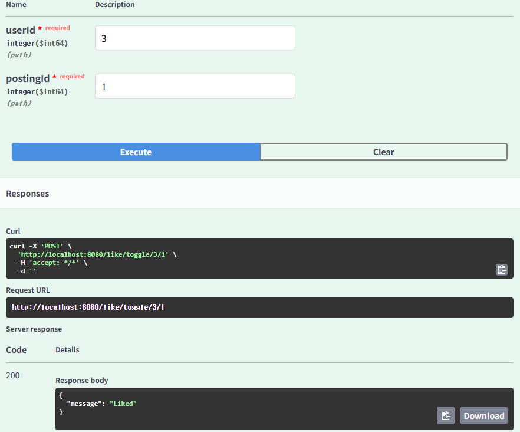

# HW4
## 안녕하십니까 조상근입니다.
먼저 많은 핑계를 대며 필수 과제밖에 하지 않은 점 매우 반성합니다...
다음에는 이런일이 없도록 하겠습니다


> 필수 과제의 조건은 이러합니다.
> 1. 작성자별 게시글 목록 조회
> 2. 새로운 게시글 작성 시 작성자 선택
> 3. 게시글 수정 및 삭제

스웩 넘치는 서버가 된 우리는 이제 Swagger를 사용합니다.

### 새로운 게시글 작성 시 작성자 선택 및 작성자별 게시글 목록 조회

새로운 게시글을 작성해봅시다. 새로운 게시글을 작성할 때에는 작성자를 선택할 수 있어야 합니다.

user와 posting을 일대다 관계로 연결지어줄 때 user_id를 posting에서 FK(왜래키)로 사용합니다. 그러면 자연스럽게 user_id를 필수로 입력 받아야 합니다.


이렇게 user_id를 required하게 되어 작성자를 선택해야 합니다. 제가 미리 만들어 놓은 1번 user를 통하여 게시글을 작성하면


1번 유저를 통하여 게시글을 찾을 때 제가 이전에 썼던 테스트 글과 새롭게 입력한 글이 나오게 됩니다. ID 기반으로 찾는다는 것을 인증하기 위해 2번 유저로 글을 찾게 되면?


이렇게 아무런 글도 뜨지 않게 된다.

### 게시글 수정 및 삭제

먼저 게시글을 수정해보자.


방금 post했던 게시글을 수정해보자. 위와 같이 patch the blog!!! 하게 되면?


이렇게 글의 내용이 바뀌게 된다.

이제 블로그 글의 내용이 맘에 들지 않으니 삭제를 해보자.


삭제는 posting_id만 필요하니 이를 입력하고 실행해보자. 그러면?


이렇게 3번의 내용이 사라지게 된다.

--- 


## 그래도 늦게나마 좋아요 구현하기...


그렇습니다... 해냈습니다...

챗지피티와 함께 힘내긴 했지만 흐름 자체는 열심히 이해하며 구현하였습니다.

> 전반적 흐름
> 1. 우리는 로그인을 하는 것이 아니기에 ```@PathVariable```로 UserId와 PostingId를 입력받습니다.
> 2. UserId와 PostingId를 서비스로 보내 이 두 조합의 Row가 존재하는지 확인합니다.
> 3. 없다면 true를 가지는 row를 새로 만들고 이미 있다면 기존에 존재하는 상태를 toggle 합니다.
> 4. boolean 값에 따라 dto의 message 함수에 값을 넣어 확인하기 쉽도록 합니다.


먼저 실험을 위해 PARD라는 멋진 이름의 유저를 만들어줍니다.



그 상태에서 3번 즉, PARD 유저가 1번 게시글에 좋아요를 누르면 {3, 1} 조합이 새로 생기며 true의 판별을 가지는 liked가 생성됩니다.


똑같은 조건에서 한번 더 실행해주면 위와 같이 "unliked"가 뜨게 됩니다.
이 상태에서 계속 누르면 누르는대로 toggle된 값이 나오게 됩니다.

---

앞으로 더 잘하겠습니다.

