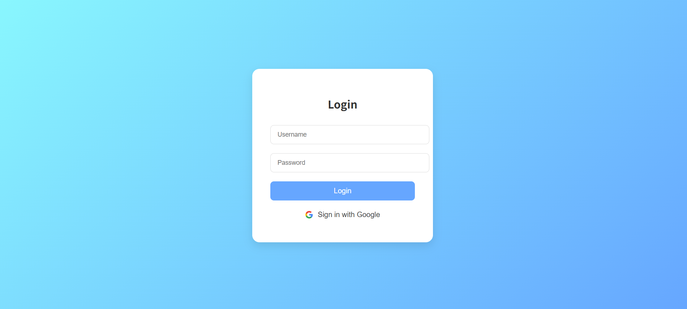
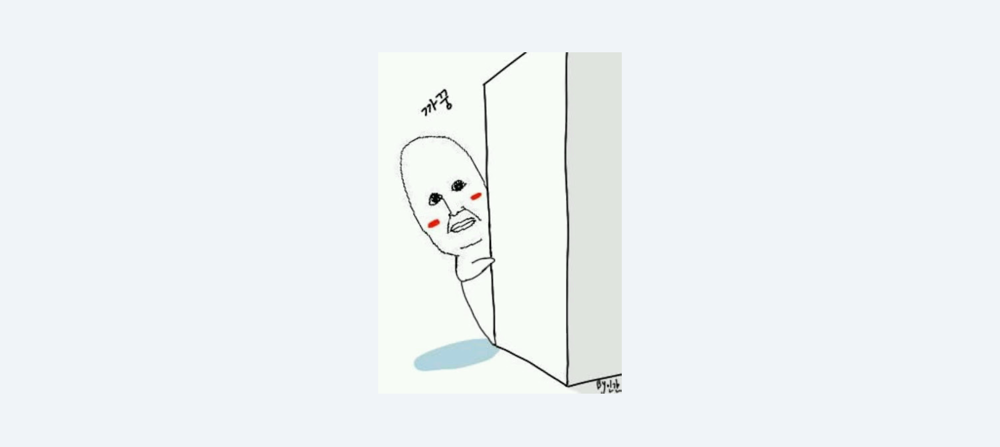
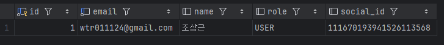

# HW5

## 나랑 스껄 할래..?
#### 구글로 로그인 하자는 뜻입니다.

---

구글로 로그인이 목표였지만 HW4를 참고하여 복습 겸 새롭게 게시판을 만드느라 시간을 다 썼네요...

그래서 게시판이 제대로 동작하는지 테스트는 못하고 제출합니다!


그래도 로그인은 테스트 했답니다 😁

---

## 로그인 결과



이렇게 예쁜 로그인 화면으로 들어가 구글로 로그인을 눌러서 성공하면?



까꿍



DB에도 제대로 적용됩니다.

---

사실 로그인은 세미나의 과정을 쭉 따라가기만 해서 아직 크게 와닿지 않습니다.

나중에 추가적인 공부를 통해서 꼭 저의 것으로 만들겠습니다.


그럼에도 제가 생각이란 걸 하면서 한 부분이 있습니다!

로그인 화면에서 ```action```을 통해서 ```/login-success```로 가기만 한다고 넘어가는 건 아니더군요?

이건 프론트에서 어디로 넘겨줄지만 정하는 것이었습니다.

실질적으로 서버(웹앱에서 가장 중요한)인 우리가 해야할 것은?

> 1. ```SecurityConfig```에서 로그인을 성공할 시 어떤 루트로 보낼 것인지 선택
> 2. ```LoginController```에서 ```/login-success```로 가면 어떤 html 파일로 Mapping 할 것인지 설정

사실 당연한건데 빨리 로그인 테스트를 해보고 싶은 마음에 눈에 보이는 것만 시도했답니다 ㅎㅎ


시정하겠습니다... 앞으로도 잘 부탁드립니다.